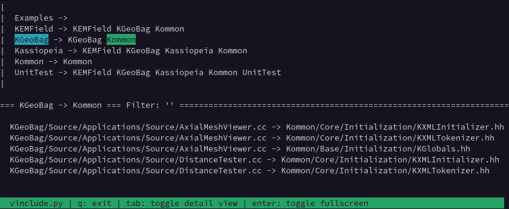

# vinclude

Visual C/C++ project include graphs, in a simple command line UI, for Linux. Useful for quickly understanding how subfolders depend on each other.

## Overview

When launched, `vinclude` looks for `#include` directives in the current directory and tries to match them to files in that directory.
Then it visualizes which subdirectory includes files from which other subdirectory:

This screenshot shows the root directory of https://github.com/KATRIN-Experiment/Kassiopeia/ .

## Limitations

`vinclude` does very simple static code analysis based on command line tools `grep` and `find`. If included files have names that occur multiple times in the source, they cannot be matched.

## Usage

After installing `vinclude` via `pip install vinclude`, it can be run in the current folder by executing `vinclude`.

On the top folders are shown that are referenced from files in a given other folder. After selecting such a folder pair with the arrow keys, at the bottom a full list of files is shown that match this pair. Tab allows to toggle between folder and file list, the enter key toggles the active list to fullscreen.

Note that you can also run the command in a subfolder of your choice to understand dependencies of source files in subfolders of that subfolder alone.
